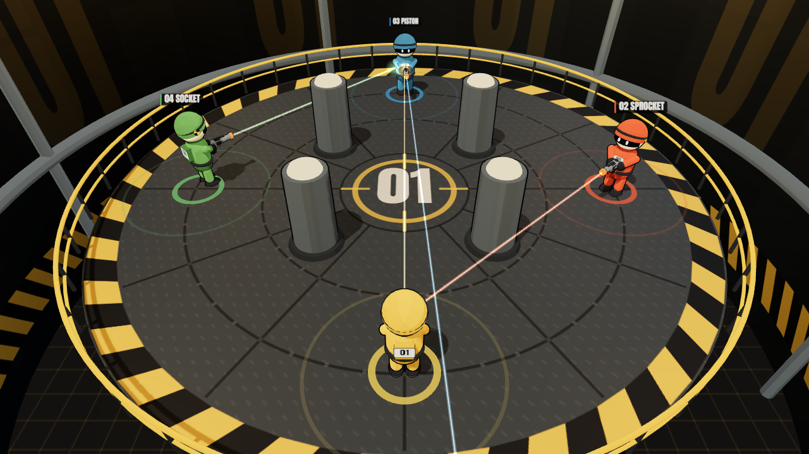
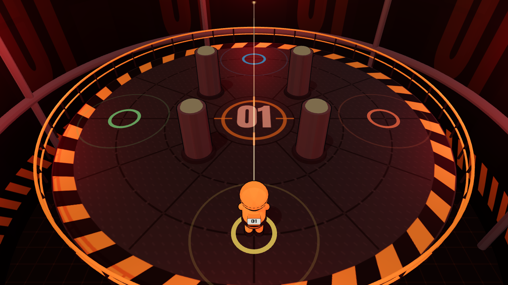
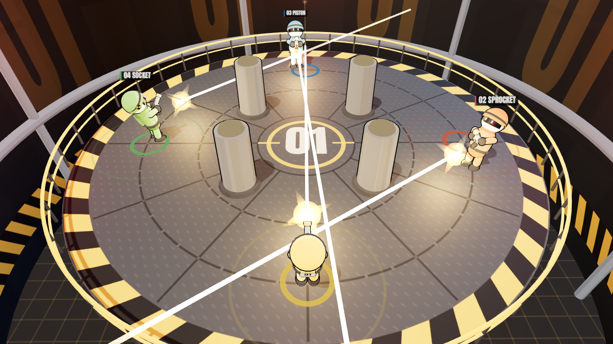
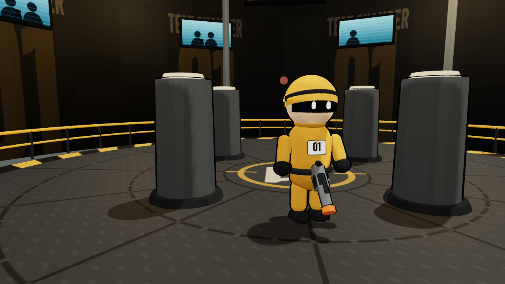
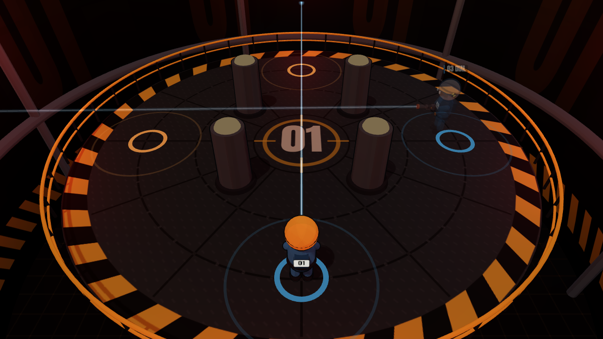

# BLIND SHOT

> **Remember. Aim. Fire.** A 3D party game that runs straight in the browser: open the link, type a name, and play.

Every subject in the test chamber holds a gun with a laser sight. For a few seconds you can see everyone and where they are aiming. Then the lights cut out and **every opponent disappears**. You keep aiming from memory and guess whether they moved, until the countdown hits zero and **everyone fires at the same moment**. The lights come back, the ragdolls fly, and the last subject standing wins.

| Visible: memorise | Blind: they're gone | Zero: everyone fires |
|---|---|---|
|  |  |  |

| Main menu | Teams: allies stay ghosted |
|---|---|
|  |  |

<!-- TODO: add a short gameplay GIF -->

---

## Core loop

`SEE → AIM → MEMORIZE → DISAPPEAR → PREDICT → SHOOT → REVEAL → LAUGH → REPEAT`

| Phase | What happens |
|---|---|
| **Round intro** | `ROUND 03` → `BLIND SHOT` → `MEMORIZE YOUR TARGET.` |
| **Spawn** | Subjects drop onto their pads |
| **Visible (5 s)** | Everyone is visible with laser sights. Aim, read who is aiming at you, and memorise |
| **Hide** | A warning tone plays, the lights flicker, and the enemies vanish (`VISUAL FEED DISABLED`) |
| **Blind + countdown (3 s)** | Enemies are truly gone. Your own laser stays. `SHOOTOUT IN 3 · 2 · 1` |
| **Fire** | Every living subject fires once, automatically, at the same moment |
| **Resolution / Reveal** | Muzzle flashes, tracers and ragdolls, then `2 SURVIVORS`, `MUTUAL ELIMINATION` or `EVERYBODY MISSED` |
| **Round results** | Shots repeat until one subject (or team) is left. That side wins the round |

A match is **first to 3 round wins** (best of 5). Hosts can change this.

## Controls (desktop)

| Input | Action |
|---|---|
| Mouse | Aim. Your subject turns to face the cursor |
| WASD / arrows | Move (light movement inside your pad's circle) |
| Shift | Sprint |
| Tab | Scoreboard |
| Esc | Pause / menu |

You never press fire. Every subject fires automatically at zero, so you get **one shot per volley**. In Settings you can switch to a pointer-locked "mouse turn" aim mode.

## Modes

* **Solo:** you plus 1 to 7 bots (EASY / NORMAL / HARD). It runs entirely in your browser with no server needed.
* **Quick Play:** joins an open public lobby, or creates one.
* **Private Room:** creates a room with a 5-character code (e.g. `K7D4Q`) for friends to join. The host configures the mode, max players (2–8), rounds, visible and blind phase length, movement on/off, friendly fire, bot fill and map.
* **Free For All:** last subject alive wins the round. If everyone dies at once, the round is a draw.
* **Teams (2v2 / 3v3 / 4v4):** blue vs orange. Teammates stay faintly visible (ghosted) while enemies are hidden. Friendly fire is off by default; with it off, bullets pass through teammates.

## Tech stack

| Layer | Choice |
|---|---|
| Language | TypeScript (strict) everywhere |
| Rendering | Three.js (one engine), toon shading with inverted-hull ink outlines |
| UI | React 18 overlay, Vite |
| Physics | Rapier (`@dimforge/rapier3d-compat`), used only on the client for ragdolls and flying guns |
| Gameplay hit tests | Analytic 2D raycasts in `packages/shared`, identical on client and server |
| Networking | Socket.IO 4 with fully typed event maps |
| Server | Node 20+, plain `http` + Socket.IO; it can also serve the built client |
| Audio | Web Audio API, procedurally synthesised (no audio files) |

## Architecture

```
apps/
  client/            Vite + React + Three.js game client
    src/game/        core (Engine, ClientWorld, GameController, Input), characters, weapons,
                     maps, camera, effects, audio, physics, modes/blindShot (presenter)
    src/networking/  GameSession interface, LocalSession (solo), NetSession + NetClient (online)
    src/state/       settings + HUD stores
    src/ui/          menus, lobby, HUD, results, settings, tutorial
  server/            Node + Socket.IO authoritative server
    src/rooms/       Room (lobby + match + host + reconnect), RoomManager (codes, quick play)
    src/game/        MatchRunner (30 Hz sim, 20 Hz filtered snapshots)
    src/networking/  typed handlers; src/players/ guest identities; src/validation/ rate limits
packages/
  shared/            Everything both sides agree on
    src/types, events, constants, gameState (config sanitiser), math, arena
    src/sim/         MatchSimulation, movement, visibility filter, shot resolution
    src/modes/       GameMode interface + BlindShotMode (the round state machine)
    src/bots/        BotBrain (fair, memory-based bots)
```

**One simulation, two hosts.** `MatchSimulation` is the same code in both places. For solo it runs inside the browser (`LocalSession`), and for online play it runs on the server (`MatchRunner`). The renderer only ever consumes a `MatchView`, so it cannot tell the two apart.

**Modular game modes.** `GameMode` (`initialize / startRound / update / endRound / cleanup`) is the extension point. `BlindShotMode` is the first implementation, and future modes (Quick Draw, Double Shot, Ricochet…) can plug into `MatchSimulation` the same way.

**Explicit state machine.** Every phase transition lives in `BlindShotMode.advance()`. Nothing else changes the phase.

## Multiplayer architecture

* The **server is authoritative** for the round phase, timers, movement, alive state, shot resolution, score, victory and room state.
* Clients send only **intent**: `playerInput { seq, moveX, moveZ, sprint, yaw }` at 30 Hz. A client never says "I hit X".
* Every input is sanitised (finite numbers, move vector clamped, yaw wrapped) and rate-limited. The server queues them and applies **one input per tick**, so a client cannot bank inputs to move faster.
* The server sends **per-player filtered snapshots** at 20 Hz. While enemies are hidden, their entries are **removed from the data**. Position, yaw, laser and shadow can't leak because the client never receives them. Eliminated spectators get the same filtering, so they can't call out positions over voice chat.
* The local subject is predicted with the shared `stepMovement` and reconciled by replaying unacknowledged inputs. Remote subjects are interpolated with a 100 ms buffer.
* **Reconnect:** a guest session token (per tab) lets a dropped player reclaim their seat for 30 s. If the host leaves, host transfers to the next player. A player who drops mid-round is removed from that round safely, and if only one side remains, the round finishes.

## How simultaneous shots work

When the countdown reaches zero (`BlindShotMode.fire()`):

1. **Snapshot.** Freeze position and yaw of every subject alive at that instant.
2. **Compute (pure).** For each shooter, raycast from the muzzle against the chamber wall, the pillars and every subject in the snapshot (skipping teammates when friendly fire is off). This step changes nothing.
3. **Apply together.** Collect every hit, then eliminate all of them at once and award points.

Because step 2 only reads the frozen snapshot, A and B can kill each other in the same volley, and shooter order never matters (there is a unit test for this). If every remaining side dies at once, the round is a draw.

Since the server fires automatically at a time it owns, latency doesn't decide who shoots first. The server uses the most recent validated aim for every player.

Scoring: hit +100, elimination +100, survived volley +50, round win +200.

## Local setup

Requires **Node 20+**.

```bash
npm install
npm run dev          # server on :3001 + client on :5173 together
```

Open <http://localhost:5173>. Solo works even if the server is not running.

Other scripts:

```bash
npm run dev:client   # client only (solo play)
npm run dev:server   # server only
npm run typecheck    # strict TS across all packages
npm test             # shared simulation tests (mutual kills, order-independence, visibility…)
npm run smoke -w @blindshot/server   # end-to-end multiplayer test against a running server
npx tsx packages/shared/src/tests/balance.ts   # bot hit-rate / round-length report
```

## Environment variables

See [`.env.example`](.env.example).

| Variable | Where | Default | Meaning |
|---|---|---|---|
| `PORT` | server | `3001` | Port to listen on (set automatically by most hosts) |
| `BLINDSHOT_PORT` | server | — | Overrides `PORT` (handy when tooling sets `PORT` for the client) |
| `CORS_ORIGIN` | server | `*` | Comma-separated allowed origins when the client is hosted elsewhere |
| `CLIENT_DIST` | server | `apps/client/dist` | Built client to serve from the same process |
| `VITE_SERVER_URL` | client (build time) | same origin (prod) / `:3001` (dev) | Where the client connects for online play |

## Production build

```bash
npm install
npm run build        # builds apps/client/dist and apps/server/dist
npm start            # serves the game AND the Socket.IO server on $PORT
```

## Deployment

**Option A, one service (simplest).** Deploy the whole repo to any WebSocket-friendly Node host (Railway, Render, Fly.io). The server serves the built client, so no CORS or extra configuration is needed.

* Build command: `npm install && npm run build`
* Start command: `npm start`
* A [`render.yaml`](render.yaml) blueprint and a [`Dockerfile`](Dockerfile) (for Fly.io / Railway / anything Docker) are included.

**Option B, static client plus game server.**

1. Deploy the server (Railway / Render / Fly.io) with `npm run build -w @blindshot/server` and `npm start`, and set `CORS_ORIGIN=https://your-client.example`.
2. Deploy `apps/client` to Vercel, Netlify or Cloudflare Pages with build command `npm run build -w @blindshot/client`, output `apps/client/dist`, and env `VITE_SERVER_URL=https://your-server.example`.

## Roadmap

Done in v0.1: the solo MVP (bots, best-of-5, ragdolls, VFX, audio, HUD, results, settings, tutorial), online rooms with quick play, reconnect and host transfer, and team mode.

Next:

* [ ] TODO: 2–4 s **replay** after each shootout (true positions, aim lines, hits)
* [ ] TODO: touch controls (left stick move, right stick aim; firing is already automatic)
* [ ] TODO: style points (Double Kill, Longest Shot, No-Move Kill, Mutual Elimination)
* [ ] TODO: pre-shootout emotes (wave, point, shrug)
* [ ] TODO: more arenas (Factory Floor, Cargo Platform, Cooling Room…) behind the existing `ArenaDef` / `MapId`
* [ ] TODO: more modes behind the `GameMode` interface (Quick Draw, Double Shot, Moving Target, Ricochet)
* [ ] TODO: cosmetic jumpsuits, helmets and gun skins (no pay-to-win)
* [ ] TODO: optional stylised gore toggle

## Asset credits

Every model, texture, sound and visual effect is **original and generated in code**. Nothing is copied from another game.

* **3D models:** procedural (`SubjectModel`, `GunModel`, `TestChamber`) built from Three.js primitives.
* **Textures:** drawn at runtime with Canvas 2D (`characters/textures.ts`, `maps/arenaTextures.ts`).
* **Audio:** synthesised at runtime with the Web Audio API (`audio/AudioEngine.ts`).
* **Fonts:** [Anton](https://fonts.google.com/specimen/Anton) by Vernon Adams and [Barlow Condensed](https://fonts.google.com/specimen/Barlow+Condensed) by Jeremy Tribby, both under the SIL Open Font License 1.1, bundled via `@fontsource`.
* **Libraries:** Three.js (MIT), Rapier (Apache-2.0), React (MIT), Socket.IO (MIT), Vite (MIT).
