<div align="center">

# BLIND SHOT

**Remember. Aim. Fire.**

A 3D multiplayer party shooter that runs right in the browser.
Memorise where everyone is, watch them vanish, move, lock in your aim, and find out who guessed right.


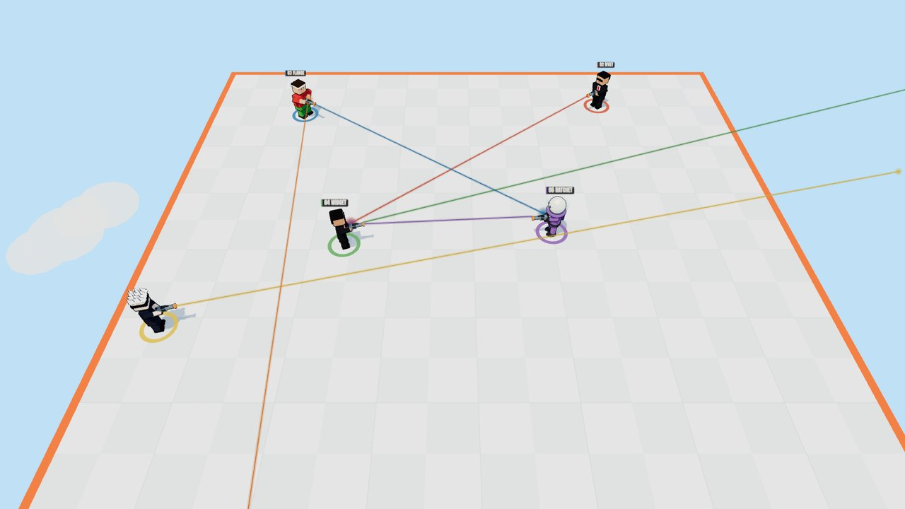

### [▶ Play now: blind-shot.onrender.com](https://blind-shot.onrender.com)

**Open the link, type a name, play.** No install, no launcher, no account.
<sub>Free hosting: the first visit after a quiet spell can take ~30–50 s while the server wakes up.</sub>

</div>

---

## Table of contents

- [The game in 30 seconds](#the-game-in-30-seconds)
- [Screenshots](#screenshots)
- [Features](#features)
- [How a round works](#how-a-round-works)
- [Architecture](#architecture)
- [Netcode and the authoritative server](#netcode-and-the-authoritative-server)
- [How shots are resolved](#how-shots-are-resolved)
- [Bots](#bots)
- [Rendering, physics and audio](#rendering-physics-and-audio)
- [Project structure](#project-structure)
- [Getting started](#getting-started)
- [Testing](#testing)
- [Deployment](#deployment)
- [Controls](#controls)
- [Codebase at a glance](#codebase-at-a-glance)
- [Roadmap](#roadmap)
- [Credits](#credits)

---

## The game in 30 seconds

Every subject on the platform holds an oversized pistol with a **laser sight**.

1. **See.** For a few seconds everyone is visible. Lasers show exactly who is aiming at whom.
2. **Vanish.** The lights cut out and **every opponent disappears**. Hidden really means hidden: the client is not even sent their positions.
3. **Move.** You get a short window to slip to a new spot while everyone is invisible.
4. **Lock.** `LOCKED`: nobody can move or turn any more. `PLAYERS REVEALED IN 5 · 4 · 3 · 2 · 1`.
5. **Freeze and fire.** Everyone reappears, frozen with their aim locked. Then the shots go off **one by one**, in a random order. If you get hit before your turn, you never fire.
6. **Laugh. Repeat.** The arena shrinks after every volley, and the last subject (or team) standing wins the round.

The White Room floats high in the sky, so walking off the edge is a very public way to lose.

---

## Screenshots

| Visible: memorise | Hidden: they're gone |
|---|---|
|  | 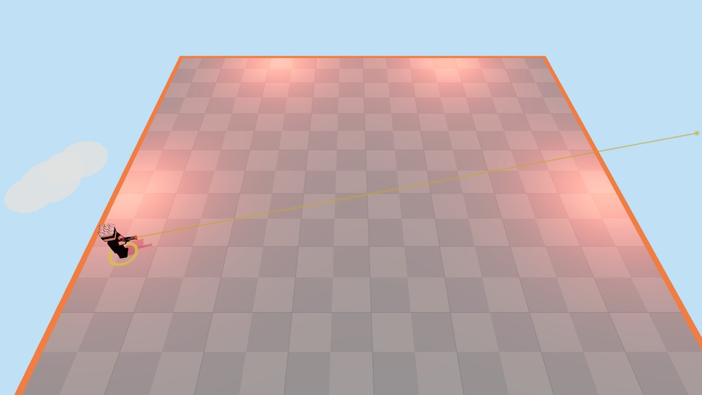 |
| **Freeze: aims locked** | **Shots, one by one** |
| 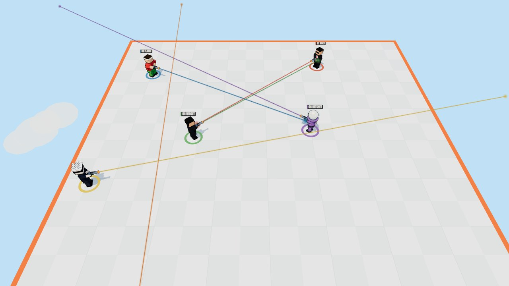 | 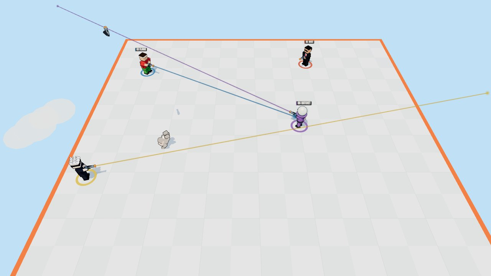 |
| **Free camera: zoom and orbit any time** | **Teams: allies stay ghosted** |
| 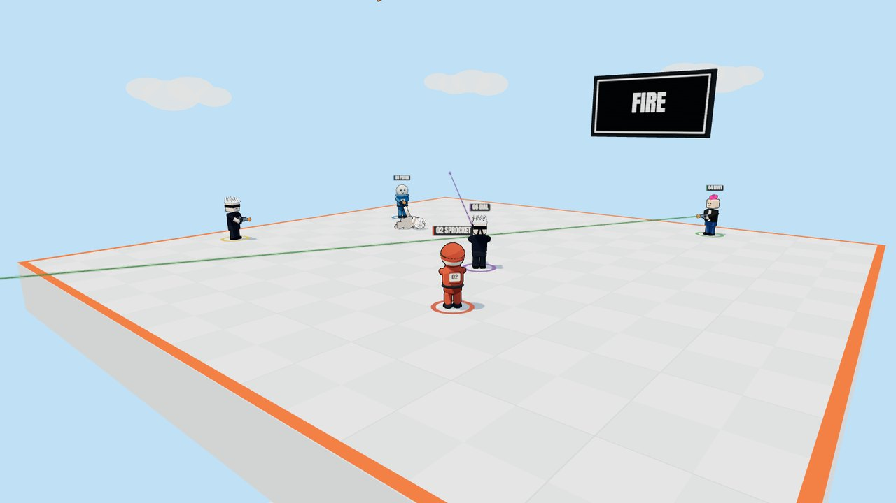 | 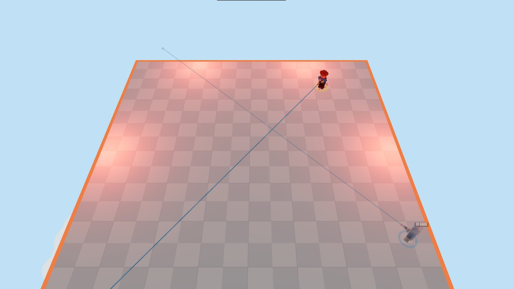 |

| Test Chamber 01 | Factory Floor | Cooling Room |
|---|---|---|
| 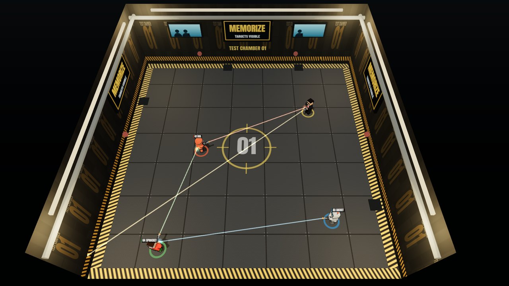 | 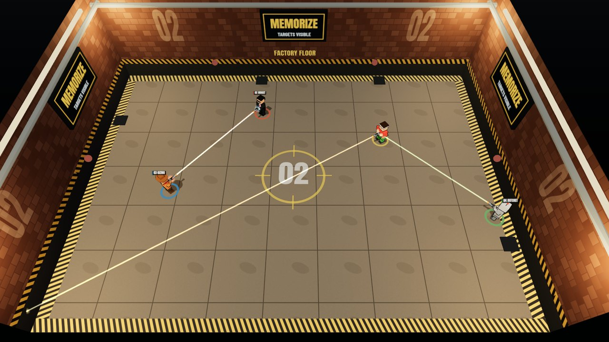 | 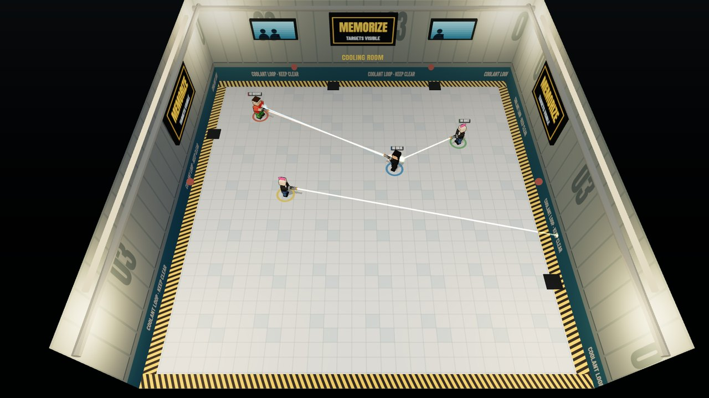 |

| Main menu | Characters |
|---|---|
| 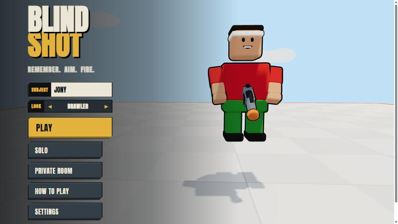 | 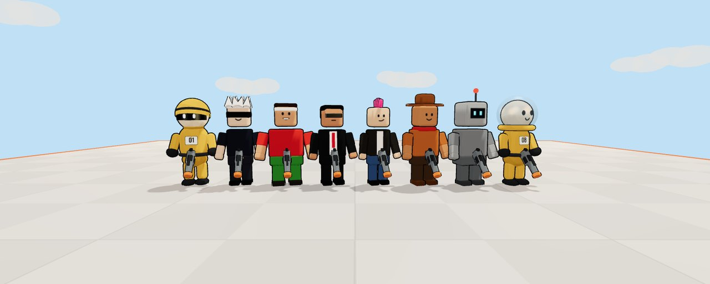 |

---

## Features

**Gameplay**
- Memory-and-prediction shooting: see, vanish, reposition, lock, reveal, fire.
- **One shot per volley.** Shots fire one by one in random order (default) or all at once (host option, with mutual kills).
- **Shrinking arena:** the boundary closes in 10% after every volley and resets each round.
- **Floating map:** the White Room has no walls, so stepping off the edge eliminates you.
- Free-for-all and **teams** (2v2, 3v3, 4v4). Teammates stay ghosted while enemies are hidden, and friendly fire is optional.
- Best-of-N matches with scoring, a per-round result card, and an end-of-match stats table (hits, accuracy, survival).

**Play modes**
- **Solo** against 1–7 bots (Easy, Normal, Hard). It runs entirely in the browser, with no server needed.
- **Quick Play** joins an open public lobby, or creates one.
- **Private rooms** use a 5-character code like `K7D4Q`. The host configures mode, players, rounds, phase timings, shot order, friendly fire, bots and map.
- **Reconnect:** drop out and rejoin your seat within 30 s. If the host leaves, host passes to another player.

**Presentation**
- 4 maps: White Room (floating sky platform), Test Chamber 01, Factory Floor, Cooling Room.
- 8 original characters with different silhouettes: Test Dummy, The Blind, Brawler, Agent, Punk, Cowpoke, Unit Bot and Astro.
- Toon shading with ink outlines, physics ragdolls, muzzle flashes, tracers, smoke, sparks and screen shake.
- A camera that always fits the whole arena. Zoom and orbit at any time to check whether a laser really lines up.
- Real recorded gunshots (CC0) plus synthesised UI, ambience and stingers.
- A minimal HUD that keeps the arena clear, and settings for audio, camera shake, flashes, colour-blind lasers and shadows.

---

## How a round works

The whole round is one explicit state machine in [`BlindShotMode`](packages/shared/src/modes/blindShot/BlindShotMode.ts). Nothing else changes the phase.

```mermaid
stateDiagram-v2
    direction LR
    [*] --> ROUND_INTRO
    ROUND_INTRO --> SPAWN: arena resets to full size
    SPAWN --> VISIBLE
    VISIBLE --> HIDE: move + aim, lasers on
    HIDE --> REPOSITION: lights flicker, enemies vanish
    REPOSITION --> COUNTDOWN: move + aim while hidden
    COUNTDOWN --> FREEZE: LOCKED, no move, no aim
    FREEZE --> SHOOTING: everyone revealed, aims locked
    SHOOTING --> REVEAL: one by one (or all at once)
    REVEAL --> VISIBLE: more than one side alive<br/>(arena shrinks 10%)
    REVEAL --> ROUND_RESULTS: one or zero sides alive
    ROUND_RESULTS --> ROUND_INTRO: next round
    ROUND_RESULTS --> MATCH_END: someone reached the win target
    MATCH_END --> [*]
```

| Phase | Default | Who can move / aim | What the player sees |
|---|---|---|---|
| Visible | 5 s (3–15) | move + aim | Everyone, with lasers |
| Hide | 0.7 s | move + aim | Warning tone, flicker, `TARGETS HIDDEN` |
| Reposition | 5 s (2–15) | move + aim | Only yourself (and ghosted teammates) |
| Countdown | 5 s (3–15) | **locked** | `LOCKED` · `PLAYERS REVEALED IN 5…1` |
| Freeze | 3 s | locked | Everyone revealed with locked lasers |
| Shooting | ~0.85 s per shot | locked | `HIT!` / `MISS`, tracers, ragdolls |

---

## Architecture

The project is a TypeScript monorepo (npm workspaces) with three packages. The key idea is that **one simulation runs in two places**:

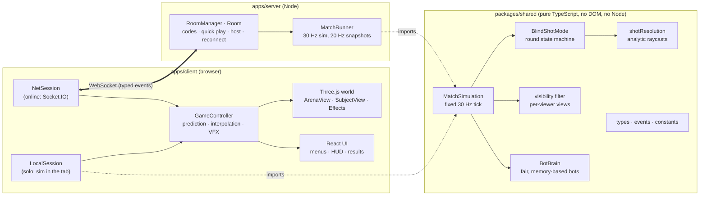

- **`packages/shared`** holds everything both sides must agree on: types, event contracts, constants, arena geometry, movement, the round state machine, shot resolution, visibility rules and bots. It has no DOM or Node dependencies, so the exact same code is the authority on the server and in solo play.
- **`apps/client`** is Vite + React + Three.js. The renderer only ever consumes a `MatchView` (what *this* player is allowed to see), so it can't tell whether that view came from a local simulation or the network.
- **`apps/server`** is plain Node `http` + Socket.IO. It hosts rooms and runs one `MatchSimulation` per match. In production it also serves the built client, so the whole game is **one deployable service**.

### Extensible game modes

`MatchSimulation` hosts a `GameMode` (`initialize / startRound / update / endRound / cleanup / canMove / canAim / onPlayerRemoved / onPlayerFell`). `BlindShotMode` is the first implementation; future modes (Quick Draw, Double Shot, Ricochet…) plug in the same way.

---

## Netcode and the authoritative server

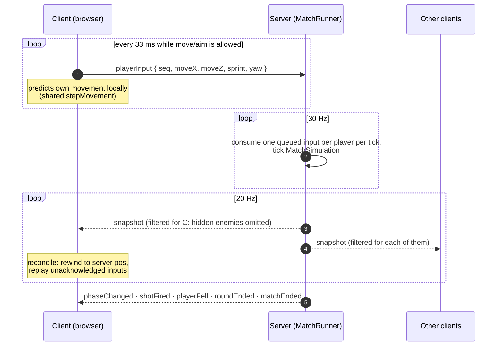

- **Clients only send intent.** A client never says "I hit X". Inputs are validated (finite numbers, move vector clamped, yaw wrapped) and rate-limited, and the server applies **one queued input per tick**, so nobody can bank inputs to move faster.
- **Hidden means not sent.** During `HIDE`, `REPOSITION` and `COUNTDOWN`, enemies are removed from each player's snapshot. There is no position, laser or shadow to peek at, not even in DevTools. Eliminated spectators are filtered the same way, so they can't call out positions. A fall that happens while hidden is announced without a position.
- **Smoothness:** your own subject is predicted with the shared `stepMovement` and reconciled by replaying unacknowledged inputs. Other subjects are interpolated with a 100 ms buffer.
- **Resilience:** session tokens let a dropped player reclaim their seat for 30 s, the host role transfers automatically, and a player who drops mid-round is removed safely. If only one side remains, the round finishes.

---

## How shots are resolved

When `COUNTDOWN` ends, the server enters `FREEZE`. From that moment no movement or aim input is applied, so every position and aim is locked on the server.

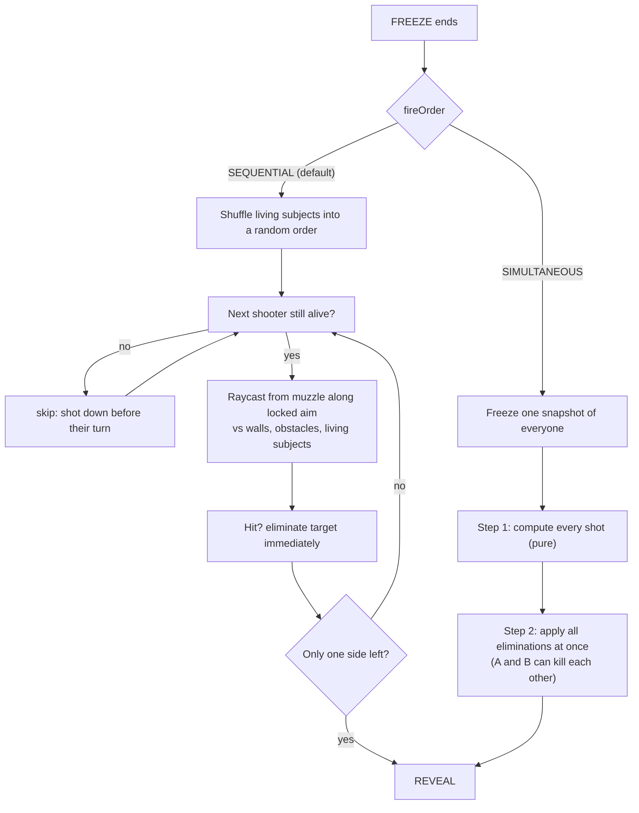

Hit tests are **analytic 2D raycasts** (ray vs circle and ray vs box on the XZ plane) in the shared package, so they give identical results on client and server, with no physics engine needed on the server. The laser sight uses the very same raycast: if a laser touches you, that shot would hit you.

Scoring: hit +100, elimination +100, survived volley +50, round win +200.

---

## Bots

Bots are honest. A `BotBrain` only reads the **same filtered view a human in its seat would get**, so hidden players are invisible to bots too. Each bot remembers last-seen positions and velocities, picks targets with weighted choices (proximity, "is aiming at me", line of sight), commits to a prediction when the lights go out, and sometimes repositions while hidden.

| | Easy | Normal | Hard |
|---|---|---|---|
| Reaction time | 0.6–1.1 s | 0.3–0.6 s | 0.15–0.3 s |
| Memory noise | 0.6 m | 0.25 m | 0.1 m |
| Aim error | ±3° | ±1.4° | ±0.7° |
| Wrong-target chance | 30 % | 10 % | 3 % |
| Predicts movement | no | partly | yes, and guesses dodges |

`npx tsx packages/shared/src/tests/balance.ts` prints hit rates and round lengths per difficulty.

---

## Rendering, physics and audio

- **Rendering:** Three.js with toon materials, inverted-hull ink outlines, pooled VFX (one draw call per particle system) and a fixed light count, so firing never triggers a shader recompile. All models and textures are built in code (Canvas 2D textures, procedural meshes).
- **Camera:** an auto-fit camera. It binary-searches the distance at which every arena corner projects inside the frame, for any window shape, then applies the player's zoom, orbit and tilt on top.
- **Physics:** [Rapier](https://rapier.rs) (WASM) runs on the client only, for ragdolls and flying guns. Gameplay never depends on it.
- **Audio:** real CC0 gunshot recordings, trimmed, bass-boosted and soft-limited for punch, plus Web Audio synthesis for UI clicks, countdown beeps, the lights-off clunk, heartbeat and ambience.

---

## Project structure

```
blind-shot/
├─ apps/
│  ├─ client/                     Vite + React + Three.js game client
│  │  ├─ public/sfx/              CC0 gunshot samples (+ LICENSE.txt)
│  │  └─ src/
│  │     ├─ game/
│  │     │  ├─ core/              Engine, ClientWorld, GameController, Input, MenuDirector
│  │     │  ├─ characters/        SubjectModel (toon), blockyLooks (blocky cast), SubjectView, Ragdoll
│  │     │  ├─ maps/              ArenaView (4 themes), procedural textures
│  │     │  ├─ camera/            CameraRig (auto-fit, free look)
│  │     │  ├─ weapons/           GunModel, LaserSight
│  │     │  ├─ effects/           Effects (flash, tracers, decals), Particles
│  │     │  ├─ audio/             AudioEngine (samples + synthesis)
│  │     │  ├─ physics/           PhysicsWorld (Rapier)
│  │     │  └─ modes/blindShot/   BlindShotPresenter (banners, lighting, popups)
│  │     ├─ networking/           GameSession, LocalSession, NetSession, NetClient
│  │     ├─ state/                tiny stores: settings, HUD
│  │     └─ ui/                   React screens: menu, solo setup, lobby, HUD, results
│  └─ server/                     Node + Socket.IO authoritative server
│     └─ src/
│        ├─ rooms/                Room (lobby, host, reconnect), RoomManager (codes, quick play)
│        ├─ game/                 MatchRunner (30 Hz tick, 20 Hz filtered snapshots)
│        ├─ networking/           typed event handlers
│        ├─ players/              guest identities + session tokens
│        ├─ validation/           rate limiter
│        └─ tests/smoke.ts        end-to-end multiplayer test
├─ packages/
│  └─ shared/                     Everything client and server agree on
│     └─ src/
│        ├─ sim/                  MatchSimulation, movement, shotResolution, visibility
│        ├─ modes/                GameMode interface, BlindShotMode state machine
│        ├─ arena/                maps, raycasts, spawns, shrinking
│        ├─ bots/                 BotBrain
│        ├─ types/ events/ constants/ gameState/ math/ util/
│        └─ tests/                simulation tests + balance report
├─ docs/screenshots/              README images
├─ Dockerfile · render.yaml       single-service deploy
└─ .env.example
```

---

## Getting started

Requires **Node 20+**.

```bash
git clone https://github.com/SHJony121/blind-shot.git
cd blind-shot
npm install
npm run dev          # game server on :3001 + client on :5173
```

Open <http://localhost:5173>. Solo works even without the server.

| Script | What it does |
|---|---|
| `npm run dev` | Client + server together, with hot reload |
| `npm run dev:client` / `npm run dev:server` | Run one side only |
| `npm run build` | Production build (`apps/client/dist` + `apps/server/dist`) |
| `npm start` | Serve the built game **and** the Socket.IO server on `$PORT` |
| `npm run typecheck` | Strict TypeScript across all packages |
| `npm test` | Simulation tests |

### Environment variables

See [`.env.example`](.env.example).

| Variable | Side | Default | Purpose |
|---|---|---|---|
| `PORT` | server | `3001` | Listen port (set by most hosts) |
| `BLINDSHOT_PORT` | server | (unset) | Overrides `PORT` |
| `CORS_ORIGIN` | server | `*` | Allowed origins when the client is hosted elsewhere |
| `CLIENT_DIST` | server | `apps/client/dist` | Built client to serve |
| `VITE_SERVER_URL` | client (build) | same origin | Game server URL for split deployments |

---

## Testing

```bash
npm test                                   # shared simulation tests
npm run smoke -w @blindshot/server         # multiplayer end-to-end (needs a running server)
npx tsx packages/shared/src/tests/balance.ts
```

The simulation tests cover:

- simultaneous mutual kills, and shot order not changing the outcome
- obstacles and friendly fire
- hidden enemies being absent from snapshots
- sequential turns: a subject shot first never fires
- falling off a floating platform
- the arena shrinking within a round and resetting each round
- movement and aim locking during the countdown
- full matches always terminating with exactly one `matchEnded`

The smoke test runs two real Socket.IO clients through a match and asserts that **no hidden enemy ever appears in a snapshot**.

---

## Deployment

The server serves the built client, so the whole game deploys as **one WebSocket-capable Node service**.

The live demo at **https://blind-shot.onrender.com** runs exactly this setup on Render's free tier, and every push to `main` redeploys it.

**Render (free tier, recommended)**
1. Sign in at [render.com](https://render.com) and connect your GitHub account.
2. **New → Blueprint** and pick this repository. [`render.yaml`](render.yaml) configures everything (`npm install && npm run build`, `npm start`, health check `/health`).
3. Open the `*.onrender.com` URL. That's the game.

**Any Docker host (Fly.io, Railway, …):** use the included [`Dockerfile`](Dockerfile), which exposes `$PORT` (default 3001).

**Split hosting:** deploy `apps/client/dist` to Vercel, Netlify or Cloudflare Pages with `VITE_SERVER_URL=https://your-server`, and run the server anywhere with `CORS_ORIGIN=https://your-client`.

---

## Controls

| Input | Action |
|---|---|
| Mouse | Aim (your subject turns to face the cursor) |
| WASD / arrows | Move (while visible and during the hidden move time) |
| Shift | Sprint |
| Mouse wheel | Zoom in (toward the cursor) and out, any time |
| Click + drag (any button) | Turn the camera; your aim holds still while you drag |
| C | Reset the camera |
| Tab | Scoreboard |
| Esc | Pause / menu |

There is no fire button. Your one shot goes off automatically after the freeze, wherever you were aiming when the lock hit.

---

## Codebase at a glance

| Package | TypeScript / TSX | Other |
|---|---|---|
| `apps/client` | ~6,650 lines | ~1,350 lines of CSS |
| `packages/shared` | ~2,350 lines | |
| `apps/server` | ~820 lines | |
| **Total** | **~9,800 lines of strict TypeScript** | ~11,800 tracked lines overall |

Strict TypeScript everywhere (`strict`, `noUncheckedIndexedAccess`, `noUnusedLocals`), typed Socket.IO event maps, and no `any` in game code.

---

## Roadmap

- [ ] A 2–4 s replay after each volley (true positions, aim lines, hits)
- [ ] Touch controls (left stick move, right stick aim; firing is already automatic)
- [ ] Style points (Double Kill, Longest Shot, No-Move Kill, Mutual Elimination)
- [ ] Pre-shootout emotes
- [ ] More modes behind the `GameMode` interface (Quick Draw, Double Shot, Ricochet)
- [ ] Cosmetics (outfits, gun skins), never pay-to-win

---

## Credits

All models, textures, maps and effects are **original and generated in code**. Nothing is copied from another game.

- **Gunshots:** single shots (1911 takes A_42P and A_34P, Smith & Wesson 642 take V_22P) from [The Free Firearm Sound Library](https://opengameart.org/content/the-free-firearm-sound-library), **CC0 1.0** (public domain). They were trimmed, mixed to mono, bass-boosted and soft-limited; see `apps/client/public/sfx/LICENSE.txt`.
- **Other sounds:** synthesised at runtime with the Web Audio API.
- **Fonts:** [Anton](https://fonts.google.com/specimen/Anton) and [Barlow Condensed](https://fonts.google.com/specimen/Barlow+Condensed), SIL Open Font License 1.1, via `@fontsource`.
- **Libraries:** Three.js (MIT), Rapier (Apache-2.0), React (MIT), Socket.IO (MIT), Vite (MIT).
